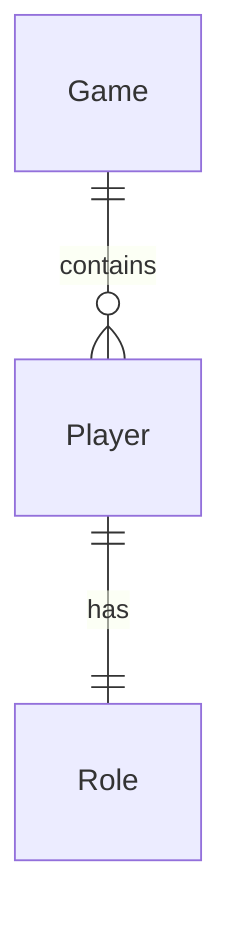

# 4. Data Model - Simplified Version

## 4.1 Core Models

### Game
```prisma
model Game {
  id        String   @id @default(uuid())
  createdAt DateTime @default(now())
  status    String   // "setup", "active", "finished"
  phase     String   // "day", "night"
  players   Player[]
}
```

### Player
```prisma
model Player {
  id      String  @id @default(uuid())
  name    String
  roleId  String
  isAlive Boolean @default(true)
  gameId  String
  game    Game    @relation(fields: [gameId], references: [id])
}
```

### Role
```prisma
model Role {
  id          String  @id @default(uuid())
  name        String
  description String
  team        String  // "villager", "werewolf", "special"
  hasNightAction Boolean @default(false)
}
```

## 4.2 Relationships Diagram


## 4.3 Common Database Operations

### Game Management
```typescript
// Create new game
const createGame = async () => {
  return await prisma.game.create({
    data: {
      status: "setup",
      phase: "day"
    }
  });
};

// Update game phase
const updateGamePhase = async (gameId: string, phase: string) => {
  return await prisma.game.update({
    where: { id: gameId },
    data: { phase }
  });
};
```

### Player Management
```typescript
// Add player to game
const addPlayer = async (gameId: string, player: { name: string, roleId: string }) => {
  return await prisma.player.create({
    data: {
      ...player,
      gameId
    }
  });
};

// Update player status
const updatePlayerStatus = async (playerId: string, isAlive: boolean) => {
  return await prisma.player.update({
    where: { id: playerId },
    data: { isAlive }
  });
};
```

## 4.4 Basic Queries

### Get Game State
```typescript
const getGameWithPlayers = async (gameId: string) => {
  return await prisma.game.findUnique({
    where: { id: gameId },
    include: {
      players: true
    }
  });
};
```

### Get Player Information
```typescript
const getPlayerWithRole = async (playerId: string) => {
  return await prisma.player.findUnique({
    where: { id: playerId },
    include: {
      game: true
    }
  });
};
```

## 4.5 Data Validation

### Basic Rules
```typescript
interface ValidationRules {
  minPlayers: number;      // Minimum 6 players
  maxPlayers: number;      // Maximum 18 players
  requiredRoles: string[]; // Must have werewolves and villagers
}

const validateGameSetup = (players: Player[]): boolean => {
  const hasEnoughPlayers = players.length >= 6;
  const hasWerewolf = players.some(p => p.role.team === "werewolf");
  const hasVillager = players.some(p => p.role.team === "villager");

  return hasEnoughPlayers && hasWerewolf && hasVillager;
};
```

## 4.6 Initial Data

### Basic Roles
```typescript
const initialRoles = [
  {
    name: "Villager",
    description: "Simple villager trying to survive",
    team: "villager",
    hasNightAction: false
  },
  {
    name: "Werewolf",
    description: "Devours a villager each night",
    team: "werewolf",
    hasNightAction: true
  },
  {
    name: "Seer",
    description: "Can see the role of another player each night",
    team: "villager",
    hasNightAction: true
  }
];
```